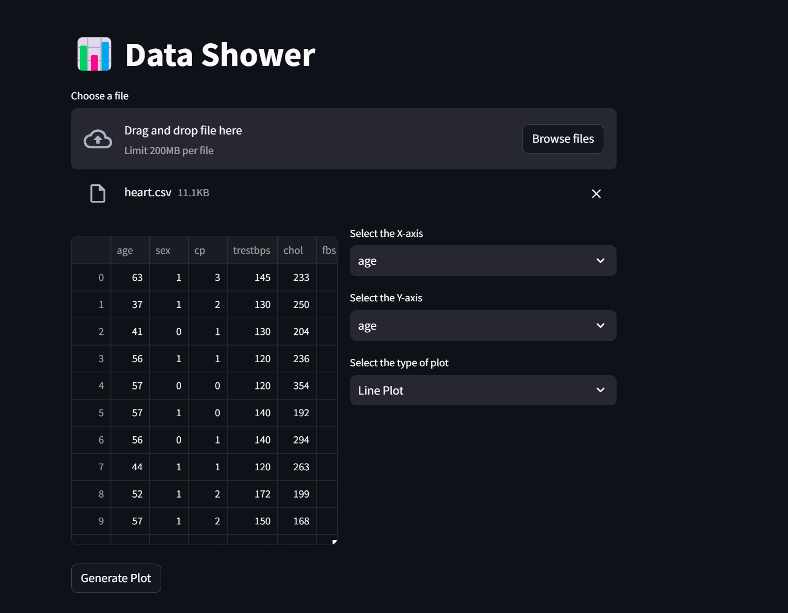

📊 Data Visualizer

A simple and interactive data visualization app built using [Streamlit](https://streamlit.io/). This app allows you to upload CSV files, view data, and create various types of plots to explore and analyze data efficiently.

🚀 [Live Demo](https://data-shower.streamlit.app/)
Click the link above to try out the Data Visualizer app directly in your browser!

Features

- File Upload: Choose a CSV file to analyze.
- Data Display: View uploaded data in tabular format.
- Customizable Plots: Select columns for X and Y axes and choose from multiple plot types:
  - Line Plot
  - Bar Chart
  - Scatter Plot
  - Distribution Plot
  - Count Plot
- User-Friendly Interface: Streamlit's intuitive UI allows for quick data exploration.

Installation

1. Clone this repository:
   ```bash
   git clone https://github.com/your-username/data-visualizer.git
   ```
2. Navigate to the project directory:
   ```bash
   cd data-visualizer
   ```
3. Install the required packages:
   ```bash
   pip install -r requirements.txt
   ```

Usage

1. Run the Streamlit app:
   ```bash
   streamlit run app.py
   ```

2. Open your browser and go to the URL provided (usually `http://localhost:8501`).

3. Upload your CSV file, select columns for visualization, and choose the plot type. Click on "Generate Plot" to see the visualization.

Folder Structure

Ensure your CSV files are in the `/data` folder within the project directory:
```
data-visualizer/
│
├── data/               # Folder for CSV files
├── app.py              # Main application code
└── requirements.txt    # Dependencies for the project
```

Code Overview

```python
import streamlit as st
import pandas as pd
import matplotlib.pyplot as plt
import seaborn as sns
```
- The app is built using Streamlit for UI and Matplotlib/Seaborn for plotting.
- You can upload your CSV file using `st.file_uploader`.
- Choose plot types using dropdown menus, and display results with `st.pyplot()`.

Screenshots



Contributing

Contributions are welcome! Feel free to submit issues or pull requests.

License

This project is licensed under the MIT License.

